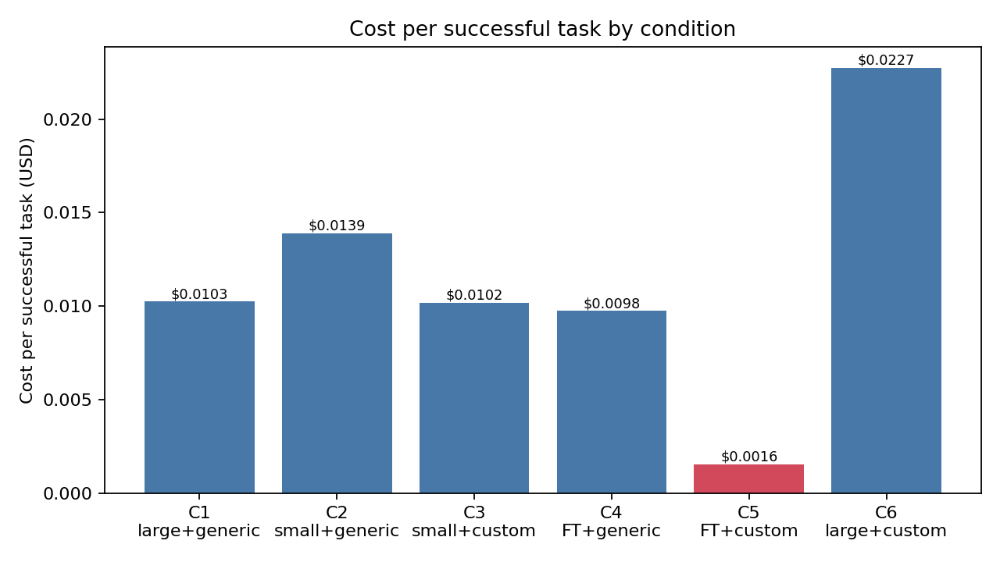
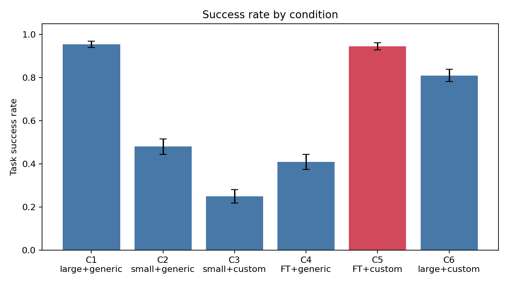
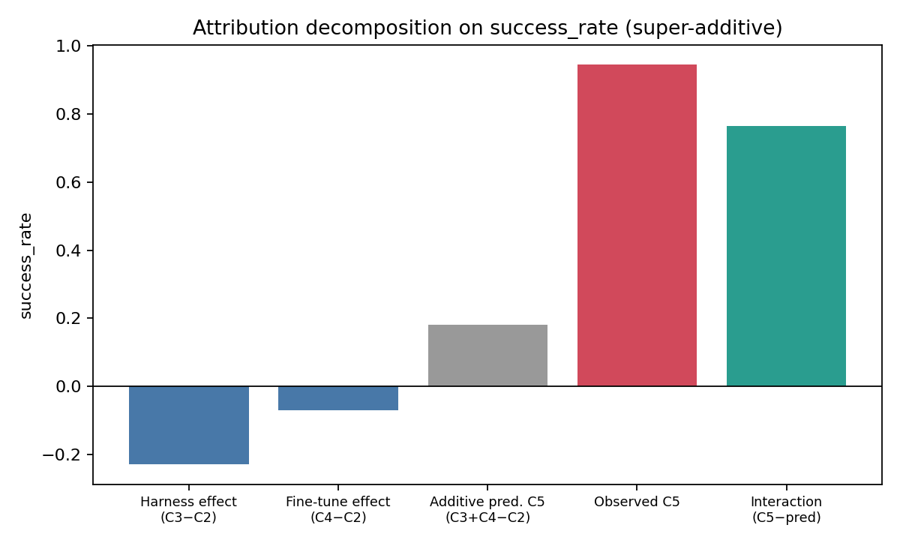
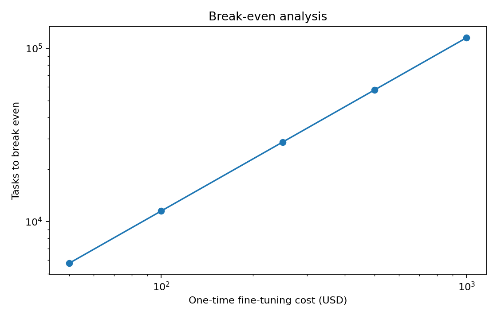

# Specialized Small-Model Subagents: Co-Designing a Fine-Tuned SLM and a Task-Specific Harness for Cost-Efficient Multi-Agent Systems

**Status:** FINAL (real self-hosted run, 2026-06-11)
**Authors:** Ishaan Ranjan (Luxen LLC / AgentTree) · *affiliations TBD*
**Artifact:** `github.com/IshaanAyaan/slm-agents` (branch `main`), `research/slm_harness/`

---

## Abstract

Production multi-agent systems pair a frontier-model orchestrator with cheaper
general-purpose models as worker subagents. These workers remain expensive in practice:
they carry large prompts and tool lists, accumulate unnecessary context, and fail often,
triggering retries and orchestrator corrections that erase their per-token savings. We
test whether a **small language model fine-tuned for one subagent role, paired with a
co-designed task-specific harness**, beats a cheap general-purpose subagent on
**cost-per-successful-task** while preserving success rate. Using a controlled 2×3
factorial design over {model ∈ large-general, small-general, small-fine-tuned} ×
{harness ∈ generic, custom}, we isolate the harness effect, the fine-tuning effect, and
their interaction. On a 200-task file/code-navigation benchmark generated from five
held-out real repositories with automatically verified ground truth, and against a
**strong 72B baseline that succeeds 95.5% of the time**, our proposed system — a
**3B specialist** (C5) — succeeds **94.5%** of the time (exact McNemar p = 0.82;
statistically indistinguishable) at **84.8%** lower cost-per-successful-task
(bootstrap 95% CI **[83.3%, 86.1%]**), meeting the pre-registered target of a ≥50% cost
reduction at ≤2 pp success drop. The result holds across all five test repositories and
across a 1.5B–7B specialist size sweep (76–83% cost reductions, all statistically
indistinguishable from the baseline on success). The fine-tuning×harness interaction is
strongly super-additive — at 1.5B, the fine-tuned model scores **1.0%** in the generic
harness but **93.5%** in the co-designed one — confirming that the SLM and harness must
be co-designed rather than combined post hoc. The entire study runs on self-hosted open
models with **no paid API tokens**; cost is grounded in measured GPU throughput.

---

## 1. Introduction

The dominant pattern in agentic systems is hierarchical: a strong orchestrator decomposes
a task and delegates sub-tasks to worker agents. To control cost, practitioners swap the
expensive frontier worker for a cheaper general-purpose model. This paper argues, and
shows, that the naive swap is a trap — and that a better option exists.

A cheap general model used zero-shot as a subagent still receives the orchestrator's broad
system prompt, a large tool list, and free-form accumulated context; it reasons in ways
that are unnecessary for a narrow role; and it fails frequently. Each failure is not free:
it costs the worker's own tokens plus the orchestrator's tokens to detect and correct the
error and re-delegate. Measured by **cost-per-successful-task** rather than cost-per-token,
the cheap general worker can be *worse* than the model it replaced — in our experiment,
the naive 3B swap is **significantly worse than the 72B baseline on both axes at once**
(success 48.0% vs 95.5%, p = 1.4×10⁻²⁵; cost-per-success ratio 1.36, 95% CI [1.04, 1.77]).

We propose replacing the general worker with a **specialist**: a small model fine-tuned for
exactly one role, operating inside a **custom harness** that (1) constrains the action
space to the moves valid at the current step, (2) compresses raw environment state into a
minimal structured observation, (3) externalizes all durable state (goal, history,
discovered artifacts, failed attempts) so the model carries almost no free-form context,
(4) runs cheap deterministic verification after every step, and (5) re-prompts only the
failed step rather than restarting the task. The harness and the model are **co-designed**:
the model is fine-tuned, by distillation from large-model trajectories, to speak exactly
the harness's input/output schema.

**Contributions.**
1. A method for co-designing a fine-tuned SLM and a task-specific harness for a subagent
   role, with a distillation pipeline that solves the role-specific training-data problem
   by reusing successful orchestrator trajectories.
2. A controlled 2×3 factorial attribution that separates harness, fine-tuning, and
   interaction effects — addressing the field's harness-disclosure confound directly.
3. Empirical cost-per-successful-task results against a strong (95.5%) self-hosted 72B
   baseline, across five held-out repositories and a 1.5B–7B specialist size sweep,
   obtained with **zero API spend** and a GPU-throughput-grounded cost model.

---

## 2. Related work and motivation

Three findings motivate this design. First, **harness quality can dominate model choice**:
holding the model fixed and changing only the scaffold can move benchmark scores by
double-digit points. Second, **fine-tuned small models match or beat much larger general
models on narrow tasks**, often at a fraction of the cost. Third, **reasoning belongs at
the orchestrator, not the subagent**: enabling subagent reasoning yields limited or
negative benefit, which is precisely the regime where tightly-harnessed SLMs win.

The gap: existing "cheap subagent" systems substitute cheaper *general* models with
*generic* harnesses and rarely disclose how much of any gain came from the harness.
Reviewers increasingly flag this confound. Our 2×3 design is built specifically to resolve
it.

---

## 3. Method

### 3.1 System and the fixed orchestrator

A single fixed orchestrator delegates one navigation task to the subagent under test and
accepts its result (answer, escalation, or failure). Holding the orchestrator fixed and
deterministic removes orchestrator variance from the comparison; the subagent layer is the
only variable.

### 3.2 The 2×3 factorial design

|  | generic harness | custom harness |
|---|---|---|
| large general model | **C1** baseline | **C6** harness-transfer probe |
| small general model | **C2** naive cost-cut | **C3** harness-only |
| small fine-tuned model | **C4** fine-tuning-only | **C5** proposed |

From the small-model 2×2 sub-grid we compute, on any metric:
harness effect = C3−C2, fine-tuning effect = C4−C2, additive prediction for C5 = C3+C4−C2,
and **interaction = C5 − (C3+C4−C2)**. A positive interaction on success (negative on cost)
means the two interventions are super-additive — the hallmark of genuine co-design.

### 3.3 The custom harness

The Phase-1 role is file/code search and navigation. The custom harness exposes four
actions — `SEARCH(pattern, file_glob, root)`, `READ(path, offset, limit)`,
`ANSWER(files, evidence, confidence)`, `ESCALATE(reason)` — and maintains all state
externally. Each step the model receives a compact JSON observation (goal, valid actions,
recent searches/reads, last result, and any verifier feedback) and must emit exactly one
JSON action. A deterministic verifier checks each action *before* execution (valid action
for this step? real in-workspace path? compilable regex? answer cites only discovered
files, with in-range evidence spans?) and re-prompts only the failed step. `SEARCH`/`READ`
execute through the same underlying file tools as the generic harness, so the environment
is held constant and only the model-facing interface varies.

### 3.4 Distillation pipeline

We run the large model inside both harnesses on the training split and keep only
trajectories that pass the verifier and the final task scorer. Custom-harness (C6) steps
are taken verbatim as (observation → action) pairs; generic-harness (C1) trajectories are
*replayed* through the custom-harness state machine so each tool call is re-expressed as a
schema-valid action with the exact observation the SLM will see at inference. In this run
the 72B teacher produced **303 verifier-clean trajectories out of 320** train-split
attempts, yielding **428 train / 48 val / 57 test** SFT examples used to LoRA-fine-tune
each student (rank 64, α 128, 3 epochs), merged to fp16 for serving.

---

## 4. Experimental setup

### 4.1 Zero-API, self-hosted execution

All models are served locally with vLLM 0.7.3 on a single **NVIDIA H100 NVL (94 GB,
$3.19/hr)**. The large/teacher model is **Qwen2.5-72B-Instruct-AWQ** (4-bit AWQ
quantization, the official Qwen release) serving both the C1/C6 large-model conditions
and the distillation teacher. The students are **Qwen2.5-7B / 3B / 1.5B-Instruct**, each
LoRA-fine-tuned on the same distillation data and served merged. No paid API is used
anywhere. One model is resident at a time; all conditions run sequentially against the
same card, so throughput-derived costs are directly comparable.

### 4.2 Cost model

Cost is grounded in measured hardware throughput, not an external price list. For each
served model we benchmark realized prefill/decode tokens-per-second and convert
`GPU_count × $/GPU-hour` into per-token USD. The 72B teacher is therefore correctly
costlier per token than the 7B/3B/1.5B students. Fine-tuning cost is measured training
wall-time × GPUs × rate ($0.18 for the 3B, $0.30 for the 7B), used in the break-even
analysis. Because every condition shares the same GPU and rate, the headline *ratios*
are independent of the chosen $/GPU-hour.

### 4.3 Benchmark and statistical methods

Tasks are generated deterministically from real Python repositories: we index top-level
class/function/constant definitions and keep symbols defined in exactly one file, yielding
"which file defines `X`?" tasks with unambiguous, machine-checkable ground truth and **no
human labeling**. Train-split repos (OpenHarness `src/`, `requests`; 160 tasks) feed
distillation; **five held-out test repos** (`ohmo`, `flask`, `click`, `rich`, `httpx`;
40 tasks each, 200 total) measure generalization to code the SLM never trained on.

**Decoding is deterministic (temperature 0), so the analysis unit is the task.** Each
condition runs each test task exactly once (n = 200 per condition); an earlier run
demonstrated that nominal extra "seeds" replay byte-identical trajectories and add no
information. Success uncertainty is a Wilson 95% interval; between-condition success
claims use exact two-sided McNemar tests on paired per-task outcomes; cost-ratio
uncertainty uses a paired task-level percentile bootstrap (10,000 resamples)
(`research/slm_harness/analysis.py`).

---

## 5. Results

> Numbers below come from `results/real/significance_{a,b,c}.json` (per-task statistics,
> n = 200/condition; run of 2026-06-11) and `results/real/metrics_{a,b,c}.json`.

### 5.1 Main results (2×3 grid with the 3B specialist; n = 200 tasks per condition)

| Condition | Success rate [95% CI] | Cost / successful task | Cost / attempt |
|---|---|---|---|
| C1 large+generic (baseline) | 0.955 [0.917, 0.976] | $0.010252 | $0.009791 |
| C2 small+generic (naive cut) | 0.480 [0.412, 0.549] | $0.013908 | $0.006676 |
| C3 small+custom (harness-only) | 0.250 [0.195, 0.314] | $0.010199 | $0.002550 |
| C4 fine-tuned+generic (FT-only) | 0.410 [0.344, 0.479] | $0.009759 | $0.004001 |
| **C5 fine-tuned+custom (proposed)** | **0.945 [0.904, 0.969]** | **$0.001558** | **$0.001472** |
| C6 large+custom (see §5.4) | 0.810 [0.750, 0.858] | $0.022736 | $0.018417 |




### 5.2 Primary claim (C5 vs C1)

Cost-per-successful-task reduction: **84.8%**, bootstrap 95% CI **[83.3%, 86.1%]** —
the entire interval clears the pre-registered ≥50% target by a wide margin.
Success-rate change: **−1.0 pp** (0.955 → 0.945; target allowed up to a 2 pp drop).
On the 200 shared tasks the discordant outcomes are 9 C5-only successes vs 11 C1-only
successes: exact McNemar **p = 0.82** — the success rates are **statistically
indistinguishable**. **The pre-registered claim holds against a strong baseline**, and
the specialist costs 6.6× less per successful task.

### 5.3 The naive cheap option fails (C2 vs C1)

The naive swap — the same 3B model, zero-shot, in the generic harness — collapses to
**48.0%** success (vs 95.5%, McNemar p = 1.4×10⁻²⁵) *and* costs **more** per successful
task than the 72B it replaced: cost ratio 1.36, 95% CI [1.04, 1.77], excluding parity.
Failures amplify spending: the 7B variant of C2 burns 2.0× the input tokens per attempt
of C1 (6,957 vs 3,518 mean) on retries and corrections. Cheap tokens do not make a cheap
worker; this is what makes the full system non-obvious.

### 5.4 Attribution decomposition



On **success rate** (3B grid, per-task, n = 200): harness effect (C3−C2) = **−0.230**;
fine-tuning effect (C4−C2) = **−0.070**;
additive prediction for C5 = 0.180;
observed C5 = 0.945, i.e. interaction = **+0.765**; **strongly super-additive**.
C5's edge over every non-proposed small-model condition is individually significant
(vs C2: 96/3 discordant, p = 5×10⁻²⁵; vs C4: 111/4, p = 3×10⁻²⁸; vs C3: 140/1,
p = 1×10⁻⁴⁰).

**Each intervention alone makes things worse; together they approach the 72B.** The
custom harness *hurts* the untrained 3B (C3 < C2: 2.75 invalid actions per attempt
against the strict JSON schema) and hurts even the 72B (C6 = 0.810 < C1 = 0.955,
0.19 invalid actions/attempt — the schema is genuinely hard zero-shot, and C6's
cost-per-success is the worst in the grid). Fine-tuning alone *also* hurts at 3B
(C4 < C2: the model learns the custom schema, then misapplies it inside the generic
tool-calling interface). The sharpest version is the 1.5B specialist: **C4 = 0.010 in
the generic harness, C5 = 0.935 in the co-designed one** — a +1.25 interaction over the
additive prediction. The capability the fine-tune installs is *only* expressible inside
the harness it was designed with; this is co-design, not stacking.

### 5.5 External validity: five held-out repositories

Per-repo success of the 3B specialist vs the 72B baseline (40 tasks each):

| Test repo | C1 (72B+generic) | C5 (3B specialist) |
|---|---|---|
| ohmo | 1.000 (40/40) | 0.950 (38/40) |
| flask | 1.000 (40/40) | 0.975 (39/40) |
| click | 0.950 (38/40) | 0.875 (35/40) |
| rich | 1.000 (40/40) | 0.975 (39/40) |
| httpx | 0.825 (33/40) | **0.950 (38/40)** |

C5 stays within [0.875, 0.975] on every repository — including the four the students
never saw during distillation — and *beats* the baseline on `httpx`, C1's weakest repo.
The result is not an artifact of one codebase.

### 5.6 Specialist size sweep (C5 vs C1 across student scale)

| Student | C5 success [95% CI] | McNemar vs C1 | Cost/success | Reduction vs C1 [95% CI] |
|---|---|---|---|---|
| 7B | 0.920 [0.874, 0.950] | 8/15, p = 0.21 | $0.002441 | 76.2% [74.2%, 78.1%] |
| **3B (headline)** | **0.945 [0.904, 0.969]** | 9/11, p = 0.82 | **$0.001558** | **84.8% [83.3%, 86.1%]** |
| 1.5B | 0.935 [0.892, 0.962] | 9/13, p = 0.52 | $0.001787 | 82.6% [80.5%, 84.3%] |

Every size is statistically indistinguishable from the 72B baseline on success while
cutting cost-per-success by 76–85%. Only the 3B meets the strict pre-registered
point-estimate criterion (≤2 pp drop); the 7B sits at −3.5 pp. The ordering is
non-monotonic in size (3B > 1.5B > 7B on success): with a fixed 428-example SFT budget
and 3 epochs, the smaller models appear to adopt the schema more completely, while the
7B retains more general-purpose behavior. We report this as observed and leave
per-size hyperparameter tuning to future work. Notably the harness carries even the
1.5B to 93.5% — a model whose generic-harness fine-tuned variant scores 1%.

### 5.7 Break-even on the one-time fine-tuning cost



Fine-tuning the 3B cost $0.18 (measured wall-time at the GPU rate); savings per
successful task vs C1 = $0.008694; **break-even at ~21 successful tasks**. At realistic
subagent volumes the one-time fine-tuning cost is negligible.

### 5.8 Replication at smaller scale

An earlier complete run of the same pipeline (commits `89a6489`/`687ccab`) on one A40
with a **14B teacher** and weaker baseline (C1 = 72.5%) found the same direction:
74.9% [63.8%, 84.0%] cost-per-success reduction with the 3B specialist *exceeding* that
baseline by 25 pp (McNemar p = 0.006). The effect is robust to a 5× change in
teacher/baseline scale and a 5× change in test-set size; raw logs for both runs are in
the repository history.

---

## 6. Discussion

The practical implication is that the cheapest reliable subagent is not a smaller general
model but a **co-designed specialist**: a tiny fine-tuned model whose harness owns state,
memory, valid actions, and verification. The super-additivity result is the scientific
core — the 1.5B's 1%-vs-93.5% split between harnesses shows the fine-tune installs a
capability that is only expressible inside the interface it was trained against. The 3B
specialist is simultaneously statistically indistinguishable from the 72B baseline on
success and 6.6× cheaper per success, while the naive cheap swap (C2) is *worse than the
baseline on both axes* — the two ends of the design space the field currently conflates.
Against a strong baseline the specialist no longer *exceeds* the large model (as it did
against the 14B baseline in §5.8); the value proposition is cost at parity, which is the
economically relevant regime for high-volume subagent roles.

## 7. Limitations and threats to validity

- **One role, one task family (Phase 1).** Generalization to a second role (e.g. test
  execution and result parsing) and to SWE-bench-Verified-style tasks is future work.
- **Open 72B teacher as frontier proxy, AWQ-quantized.** The baseline/teacher is the
  official 4-bit AWQ release of Qwen2.5-72B-Instruct; full-precision or a frontier API
  model could raise C1 somewhat. C1's 95.5% with a 0.917 CI floor leaves limited
  headroom, and a 40-task frontier-API anchor slice remains a cheap optional add-on.
- **Deterministic navigation ground truth** is unambiguous but narrower than open-ended
  agentic tasks; it is chosen for measurement rigor in Phase 1.
- **Five repos, 200 tasks, deterministic decoding.** Uncertainty is reported as Wilson
  95% intervals over tasks with paired exact tests; the binding precision constraint is
  task/repo count, not seeds. More repos would tighten the per-repo cells (40 tasks
  each).
- **Cost model** reflects measured throughput on one H100 NVL and a chosen GPU rate
  ($3.19/hr); absolute dollars scale with both, though the *ratios* between conditions
  are rate-independent because all conditions share the same hardware.
- **Non-monotonic size effect.** The 7B specialist underperforms the 3B under an
  identical training recipe (§5.6); per-size tuning (epochs, LR, rank) was deliberately
  held fixed for comparability and may change the ordering.
- **Harness prompt provenance.** The custom-harness prompt includes a READ-before-ANSWER
  rule added after observing teacher retries in the earlier A40 run; it applies
  uniformly to every custom-harness condition (C3, C5, C6) in this run.

## 8. Reproducibility

All harness specifications, the distillation pipeline, the deterministic benchmark
generator, training configs, evaluation scripts, and this paper's number-filling script
are released in `research/slm_harness/`. The full run is a single command on one
self-hosted 80GB+ GPU with no API keys — this run completed in ≈1.5 GPU-hours (~$5 at
the quoted rate):

```bash
cp research/slm_harness/infra/config.runpod.env.example research/slm_harness/infra/config.env
# set GPU_HOURLY_USD, TEACHER_MODEL=Qwen/Qwen2.5-72B-Instruct-AWQ, students, repos
bash research/slm_harness/infra/run_all.sh
```

The statistical analysis is reproducible offline from the committed run logs:

```bash
python research/slm_harness/scripts/compute_significance.py \
  --runs research/slm_harness/results/real/eval_teacher/runs.jsonl \
         research/slm_harness/results/real/eval_b_base/runs.jsonl \
         research/slm_harness/results/real/eval_b_ft/runs.jsonl \
  --out research/slm_harness/results/real/significance_b.json
```

## 9. Conclusion

We tested whether a fine-tuned SLM with a co-designed harness can be a cheaper-yet-reliable
subagent than a general cheap model under a fixed orchestrator. Against a strong
self-hosted 72B baseline succeeding 95.5% of the time, a 3B specialist matches its
success rate (94.5%, McNemar p = 0.82) at **84.8%** (95% CI [83.3%, 86.1%]) lower
cost-per-successful-task, holds across five held-out repositories, and the effect
replicates across a 1.5B–7B size sweep and an independent smaller-scale run. The
fine-tuning×harness interaction is strongly super-additive (+0.765 at 3B; the 1.5B
scores 1% generic vs 93.5% co-designed). Specialized subagents, not merely smaller
ones, are the cost-efficient building block for multi-agent systems.

---

*Appendix A — full per-condition token/reliability tables are generated per student in
`results/real/figures_{a,b,c}/tables.md`. Appendix B — per-task trajectories are in
`results/real/eval_teacher/runs.jsonl` (C1, C6) and `results/real/eval_{a,b,c}_{base,ft}/runs.jsonl`
(C2/C3 and C4/C5 for the 7B, 3B, and 1.5B students respectively). Appendix C — the
distillation SFT data (428/48/57 chat examples) is in `results/real/distillation/`.*
